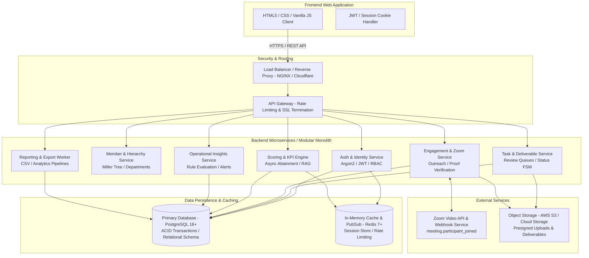

# Useme Team Platform — Technical Documentation: System Overview & Architecture

## 1. Executive Summary & Purpose

The **Useme Team Performance Tracking Platform** is an enterprise-grade operational management and talent performance appraisal application designed for high-growth direct selling, fintech, and distributed technology organizations.

The platform provides a centralized, transparent operating system that connects day-to-day operational execution (task management, project tracking, event coordination) with quantitative performance measurement (Key Result Areas [KRAs], Key Performance Indicators [KPIs], Key Risk Indicators [KRIs], outreach engagement, and peer mentorship).

### Core Problem Solved
In distributed, high-velocity teams, performance evaluations often suffer from subjective bias, fragmented activity logs across chat/spreadsheets, delayed review feedback, and lack of real-time visibility into operational bottlenecks. Useme Team solves this by:
1. **Unifying Operational Deliverables & Appraisal**: Tasks and project deliverables directly drive quantitative KRA pillar attainment and submission quality ratings.
2. **Gamified & Verified Outreach**: Social and field engagement activities are logged with verifiable proof (URLs, screenshots, documents) and approved by administrators.
3. **Continuous Peer Motivation & Attendance Tracking**: Synchronous video sessions (Zoom syncs) and leadership talks are logged with attendance streak calculations.
4. **Automated Risk Detection**: An automated rules engine flags stalled tasks, rework clusters, capacity bottlenecks, at-risk projects, and repeated sync absences before milestones are breached.

---

## 2. User Personas & Role-Based Access

The platform natively supports two core organizational personas:

```
+----------------------------------------------------------------------------------------------------+
|                                      ORGANIZATIONAL PERSONAS                                       |
+------------------------------------+---------------------------------------------------------------+
| Administrator (Admin)              | Team Member (Member)                                          |
+------------------------------------+---------------------------------------------------------------+
| • Operations Heads, HR Directors,   | • Software Engineers, Designers, Financial Analysts,         |
|   Engineering Managers, Executives |   Field Outreach Specialists, Support Agents                  |
| • Full system authority            | • Self-service visibility and deliverable execution           |
| • Create & assign tasks/projects   | • View assigned tasks and linked projects                     |
| • Review & approve submissions     | • Transition task status (Testing, Awaiting Feedback)         |
| • Onboard, assign & offboard staff | • Upload deliverable proof assets & submit for review         |
| • Configure review cycles & KRAs   | • Log verified outreach & motivation activities               |
| • Override Zoom attendance         | • Join scheduled Zoom syncs (self-capture check-in)           |
| • View organization-wide analytics | • Self-declare skill proficiencies (marked unverified)        |
| • Export audit reports & CSVs      | • Track personal ranking, KRA attainment & composite scores   |
| • Manage department registry       | • Update personal account password                            |
+------------------------------------+---------------------------------------------------------------+
```

---

## 3. High-Level Architecture

### Current Frontend-Only Architecture (Pre-Migration)
The current frontend build is completely self-contained within the browser client. All state is maintained in-memory and synchronized to browser `localStorage`. Business logic, scoring engines, attendance verification, and search indexing are executed synchronously on the client CPU.

```mermaid
graph TD
    subgraph Browser Client [Client-Side Browser Runtime]
        UI[Vanilla HTML5 / Modern CSS / Modular JS]
        Router[Page Navigation & Query Routing]
        
        subgraph Logic Layer [Client-Side Evaluation Engines]
            Scoring[Scoring Engine<br/>scoring-engine.js]
            KPI[KPI Engine<br/>kpi-engine.js]
            Targets[Targets Resolver<br/>scoring-targets.js]
            Insights[Automated Insights<br/>insights.js]
            Search[Command Palette Indexer<br/>command-palette.js]
        end
        
        subgraph Store Layer [Client Storage Adapter]
            DS[Central DataStore Facade<br/>data-store.js]
            DSWrites[Task/Project Writes<br/>data-store-writes.js]
            DSTeam[Team/Auth Writes<br/>data-store-team-writes.js]
        end
        
        Storage[(Browser localStorage<br/>useme_data_store)]
    end
    
    UI --> Router
    UI --> Logic Layer
    UI --> Store Layer
    Logic Layer --> DS
    Store Layer --> Storage
```

### Target 3-Tier Enterprise Architecture (Backend Handoff)
The backend engineering team will replace the browser `localStorage` layer and client-side authorization checks with a hardened, distributed backend infrastructure.



---

## 4. Current Frontend Tech Stack

The existing codebase was engineered to run without bundlers or heavy build frameworks, maintaining high visual fidelity, predictable performance, and strict modularity.

| Layer | Technologies & Conventions |
| :--- | :--- |
| **Markup** | HTML5 semantic structure across 15 purpose-built page layouts (`dashboard.html`, `hierarchy.html`, `tasks.html`, `submissions.html`, `projects.html`, `events.html`, `ranking.html`, `insights.html`, `kra.html`, `engagement-motivation.html`, `resources.html`, `reports.html`, `skill-mapping.html`, `profile.html`, `index.html`). |
| **Styling (CSS)** | Modern Vanilla CSS without Tailwind or preprocessors. Structured design token architecture (`css/variables.css`) providing HSL and Hex tokens (`--color-primary: #E8514D`, `--pastel-peach`, `--pastel-lavender`, `--pastel-mint`, `--radius-pill`, `--shadow-card`). |
| **Client Scripting** | Plain JavaScript (ES6+), structured into Immediately Invoked Function Expressions (IIFEs) and event-driven modular controllers (`js/`). Strict adherence to modular file limits ($\le 150$ lines per file for specialized modules). |
| **Client State** | Single Central DataStore (`window.DataStore`) maintaining a synchronized in-memory database (`_data`) backed by browser `localStorage` under key `useme_data_store`. |
| **Cryptographic Hash** | Synchronous client-side SHA-256 hashing (`sha256(str)`) implemented natively in `js/data-store.js` for zero-dependency password digest verification. |
| **Visual Assets** | Embedded vector SVGs and localized demo media assets (`assets/`). No external image hosting dependencies. |

---

## 5. What the Backend Needs to Build & Replace

The following five architectural components must be constructed by the backend engineering team to transition the application into production:

### 1. Database Persistence Layer (Replacing `localStorage`)
- **Current**: The entire database is serialised as a single JSON blob into browser `localStorage.getItem('useme_data_store')` (~2.7MB seed). It is vulnerable to browser storage wipes, 5MB quota exhaustion, and cannot support concurrent multi-user writes.
- **Backend Requirement**: Implement a normalized relational schema (recommended: PostgreSQL 15+) with foreign key constraints, composite indices, database-level timestamps, and ACID transactions. See [Data Models](file:///e:/TEZSID/35th%20Task%20-%20UsemeTeam/useme-team-performance/docs/02-data-models.md).

### 2. Real Authentication & Session Tokens (Replacing Mock Auth)
- **Current**: The frontend checks credentials against stored SHA-256 hashes and sets insecure client cookies/localStorage keys (`useme_logged_in = true`, `useme_role = "admin"`, `useme_user_id = "m1"`). Any user can escalate privileges by modifying `localStorage`.
- **Backend Requirement**: 
  - Standard OAuth2 / Session cookie or JWT-based authentication.
  - Secure, `HttpOnly`, `SameSite=Lax`, `Secure` cookies containing a signed session token.
  - Password hashing via **Argon2id** or **bcrypt** ($cost \ge 12$) on the server.
  - Rate-limited login endpoints with brute-force lockout.

### 3. Server-Side Role-Based Access Control (RBAC)
- **Current**: Write methods in `data-store-writes.js` and `data-store-team-writes.js` inspect a client-supplied user object (`u?.role`). Several methods (`updateMemberScores`, `logActivity`) contain no authorization checks at all.
- **Backend Requirement**: 
  - Middleware that decodes the authenticated session on every request and assigns a verified `req.user` context.
  - Strict role enforcement rejecting unauthorized requests with HTTP `403 Forbidden`.
  - Resource ownership checks (e.g. verifying a member is assigned to task $T$ before accepting a deliverable upload). See [Roles & Permissions](file:///e:/TEZSID/35th%20Task%20-%20UsemeTeam/useme-team-performance/docs/03-roles-permissions.md).

### 4. Server-Side Scoring Engine & Asynchronous Workers
- **Current**: KRA pillar scores, attendance streaks, engagement points, quality scores, and ranking leaderboard positions are calculated on-the-fly inside client browser threads.
- **Backend Requirement**:
  - Encapsulate the authoritative formulas from `scoring-engine.js` and `kpi-engine.js` into a server-side scoring service.
  - Execute score recalculations inside database transaction hooks or async task queues (e.g., Celery, BullMQ, or Go workers) whenever task statuses change or activities are approved.
  - Materialize rankings and composite scores in dedicated database tables for sub-millisecond query responses.

### 5. Production Media & External Webhook Ingestion
- **Current**: File uploads are simulated via metadata strings, and Zoom attendance relies on a self-check-in click timestamp compared against scheduled session times.
- **Backend Requirement**:
  - Secure presigned URL generation (AWS S3 / Google Cloud Storage) for deliverable files and activity proofs, with MIME-type validation and virus scanning.
  - Ingestion of live **Zoom Webhooks** (`meeting.participant_joined`, `meeting.participant_left`, `meeting.ended`) to calculate verified attendee dwell time, eliminating client-side self-check-in latency disputes.
