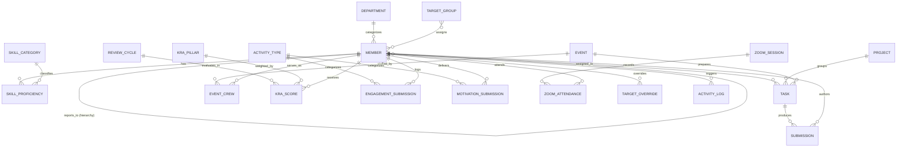

# Useme Team Platform — Technical Documentation: Data Models & Entity Schemas

This document provides the definitive data dictionary for all entities across the Useme Team platform. Every entity is specified with its native JavaScript type, suggested PostgreSQL column type, nullability constraint, default value, enumeration constraints, and relational foreign keys.

---

## 1. Entity Relationship Diagram (High-Level)



---

## 2. Core Identity & Organizational Entities

### 2.1 Member (`members`)
Primary entity representing team members, managers, and administrators. Supports hierarchical reporting and performance score caching.

| Field Name | Type (JS / SQL) | Required | Allowed Values / Enums / Defaults | Relationships & Notes |
| :--- | :--- | :--- | :--- | :--- |
| `id` | `string` / `VARCHAR(64)` | **Yes** | Primary Key (e.g. `"m1"`, `"m180"`) | Primary identifier across all sub-systems. |
| `name` | `string` / `VARCHAR(255)` | **Yes** | Any trimmed string (min 2 chars) | Full display name of the member. |
| `username` | `string` / `VARCHAR(100)` | **Yes** | Lowercase alphanumeric, `.`, `_`, `-` | Unique login identifier. Auto-derived from name. |
| `email` | `string` / `VARCHAR(255)` | **Yes** | Valid RFC 5322 email | Unique corporate email address. |
| `passwordHash` | `string` / `CHAR(64)` | **Yes** | 64-character lowercase hex (SHA-256) | Passwords must be migrated to Argon2/bcrypt on backend. |
| `phone` | `string` / `VARCHAR(32)` | No | Valid phone string. Default `""` | Contact phone number. |
| `role` | `string` / `VARCHAR(100)` | **Yes** | Functional job title (e.g. `"Lead Architect"`, `"Unassigned"`) | Display job title. |
| `department` | `string` / `VARCHAR(100)` | **Yes** | Must match an active `Department.name` | Foreign Key $\to$ `departments.name`. Default `"Unassigned"`. |
| `band` | `string` / `VARCHAR(64)` | **Yes** | `L1 - Associate`, `L2 - Junior Associate`, `L3 - Specialist`, `L4 - Mid Specialist`, `L5 - Manager`, `L6 - Principal Lead`, `L7 - Director`, `Unassigned` | Seniority and compensation level. |
| `location` | `string` / `VARCHAR(128)`| **Yes** | e.g. `"Bangalore, IN"`, `"Remote (Pune)"` | Workstation or base city. |
| `reportsTo` | `string` / `VARCHAR(64)` | No | `null` or valid `Member.id` | Foreign Key $\to$ `members.id`. Self-reporting & cycles disallowed. |
| `avatar` | `string` / `VARCHAR(8)`  | **Yes** | 2-character capitalized initials (e.g. `"AS"`) | Display badge initials. |
| `startDate` | `string` / `DATE`        | **Yes** | ISO-8601 Date (`YYYY-MM-DD`) | Employment / contract start date. |
| `joinedDate`| `string` / `VARCHAR(32)` | No | e.g. `"Jan 2023"`, `"Sep 2026"` | Formatted display tenure string. |
| `skills` | `string[]` / `JSONB`     | **Yes** | Array of string skill names (max 6) | Primary skill badges displayed on profile. |
| `skillCategory`| `string` / `VARCHAR(64)`| No | `dev`, `data`, `finance`, `design`, `marketing`, `support`, `null` | Foreign Key $\to$ `skillCategories.id`. Primary skill domain. |
| `proficiency` | `string` / `VARCHAR(32)`| **Yes** | `Beginner`, `Intermediate`, `Advanced`, `Expert` | Primary proficiency level. Default `"Beginner"`. |
| `verified` | `boolean` / `BOOLEAN`    | **Yes** | `true`, `false`. Default `false` | Set to `true` when verified by an administrator. |
| `rank` | `string` / `VARCHAR(16)` | **Yes** | e.g. `"#1"`, `"#12"`, `"#180"` | Ordinal ranking among all active members. |
| `kpiScore` | `number` / `NUMERIC(5,2)`| **Yes** | Range `[0.0, 100.0]`. Default `75.0` | Cached gross KPI score. |
| `kriPenalty` | `number` / `NUMERIC(5,2)`| **Yes** | Range `[0.0, 100.0]`. Default `0.0` | Cached gross KRI penalty deductions. |
| `compositeScore`| `number` / `NUMERIC(5,2)`| **Yes** | Range `[0.0, 100.0]`. Default `75.0` | Cached net score (`kpiScore - kriPenalty`). |
| `activeTasks` | `number` / `INTEGER`    | **Yes** | Non-negative integer. Default `0` | Cached count of active incomplete tasks. |
| `isActive` | `boolean` / `BOOLEAN`    | **Yes** | `true`, `false`. Default `true` | Soft-delete flag. Inactive members are hidden from rosters. |
| `isUnassigned`| `boolean` / `BOOLEAN`   | **Yes** | `true`, `false`. Default `false` | True for self-registered members awaiting hierarchy assignment. |
| `offboardedAt`| `string` / `TIMESTAMPTZ`| No | ISO-8601 Timestamp or `null` | Recorded when an admin offboards the member. |
| `lastRoleUpdated`| `string` / `VARCHAR(32)`| No | Formatted date string or `null` | Audit marker for role title updates. |

---

### 2.2 Department (`departments`)
Organizational business units used for workforce grouping, filtering, and reporting.

| Field Name | Type (JS / SQL) | Required | Allowed Values / Enums / Defaults | Relationships & Notes |
| :--- | :--- | :--- | :--- | :--- |
| `id` | `string` / `VARCHAR(64)` | **Yes** | Unique slug (e.g. `"dept-eng"`, `"dept-prod"`) | Primary Key. |
| `name` | `string` / `VARCHAR(100)` | **Yes** | Unique name (e.g. `"Engineering"`) | Unique natural key referenced by `Member.department`. |
| `colorHex` | `string` / `VARCHAR(16)` | **Yes** | Valid Hex color (e.g. `"#2563EB"`, `"#E8514D"`) | UI accent color used for department tags and pills. |
| `order` | `number` / `INTEGER`     | **Yes** | Positive integer (e.g. `1`, `2`, `7`) | Sequence index for sort order in dropdowns. |

---

### 2.3 Skill Category (`skillCategories`)
Standardized competency domains across which members are evaluated and tasks are classified.

| Field Name | Type (JS / SQL) | Required | Allowed Values / Enums / Defaults | Relationships & Notes |
| :--- | :--- | :--- | :--- | :--- |
| `id` | `string` / `VARCHAR(64)` | **Yes** | `dev`, `data`, `finance`, `design`, `marketing`, `support` | Primary Key. Referenced by tasks and proficiencies. |
| `name` | `string` / `VARCHAR(100)` | **Yes** | e.g. `"Software Development"`, `"CA / Finance"` | Canonical category name. |
| `description`| `string` / `TEXT`        | No | Description of technologies and competencies | Explanatory subtitle for skill directory cards. |
| `count` | `number` / `INTEGER`     | No | Non-negative integer (Computed) | Dynamic count of active members holding proficiency. |

---

### 2.4 Skill Proficiency (`skillProficiencies`)
Granular member-to-skill competency records detailing verified mastery levels.

| Field Name | Type (JS / SQL) | Required | Allowed Values / Enums / Defaults | Relationships & Notes |
| :--- | :--- | :--- | :--- | :--- |
| `id` | `string` / `VARCHAR(128)`| **Yes** | Composite (e.g. `"sp-m5-dev"`) | Primary Key. Unique per `(memberId, categoryId)`. |
| `memberId` | `string` / `VARCHAR(64)` | **Yes** | Valid `Member.id` | Foreign Key $\to$ `members.id`. |
| `categoryId` | `string` / `VARCHAR(64)` | **Yes** | Valid `SkillCategory.id` | Foreign Key $\to$ `skillCategories.id`. |
| `level` | `string` / `VARCHAR(32)` | **Yes** | `Beginner`, `Intermediate`, `Advanced`, `Expert` (or `L1`, `L2`, `L3`, `L4`) | Evaluated mastery level. |
| `lastUpdated`| `string` / `TIMESTAMPTZ`| **Yes** | ISO-8601 Timestamp | Timestamp when the level was declared or verified. |
| `updatedBy` | `string` / `VARCHAR(64)` | **Yes** | Valid `Member.id` (or `"admin"`) | Foreign Key $\to$ `members.id`. Sets `verified: true` if admin. |

---

## 3. Operational Execution: Tasks, Projects & Events

### 3.1 Task (`tasks`)
Operational deliverables assigned to team members, driving KRA quality and velocity scoring.

| Field Name | Type (JS / SQL) | Required | Allowed Values / Enums / Defaults | Relationships & Notes |
| :--- | :--- | :--- | :--- | :--- |
| `id` | `string` / `VARCHAR(64)` | **Yes** | e.g. `"t1"`, `"t1250"` | Primary Key. |
| `title` | `string` / `VARCHAR(255)` | **Yes** | Trimmed string (min 3 chars) | Deliverable title. |
| `description`| `string` / `TEXT`        | No | Detailed instructions / architectural specs | Full scope of work. |
| `assignedTo` | `string[]` / `JSONB`     | **Yes** | Array of valid `Member.id`s (min 1) | Foreign Keys $\to$ `members.id`. Multi-assignee supported. |
| `linkedSkill`| `string` / `VARCHAR(64)` | **Yes** | Valid `SkillCategory.id` | Foreign Key $\to$ `skillCategories.id`. Default `"dev"`. |
| `linkedProject`| `string` / `VARCHAR(255)`| No | Project name string or `null` | Denormalized reference for fast UI rendering. |
| `projectId` | `string` / `VARCHAR(64)` | No | Valid `Project.id` or `null` | Foreign Key $\to$ `projects.id`. |
| `eventId` | `string` / `VARCHAR(64)` | No | Valid `Event.id` or `null` | Foreign Key $\to$ `events.id` (for event prep tasks). |
| `cycleId` | `string` / `VARCHAR(64)` | No | Valid `ReviewCycle.id` or `null` | Foreign Key $\to$ `cycles.id`. |
| `status` | `string` / `VARCHAR(32)` | **Yes** | `notStarted`, `inProgress`, `testing`, `awaitingFeedback`, `reworkNeeded`, `completed`, `cancelled` | Task lifecycle FSM status. Default `"notStarted"`. |
| `dueDate` | `string` / `DATE`        | **Yes** | ISO-8601 Date (`YYYY-MM-DD`) | Target milestone deadline. |
| `resources` | `string[]` / `JSONB`     | No | Array of document/spec reference titles | Guides and resource documents provided to assignees. |
| `assets` | `object[]` / `JSONB`     | No | Array of `TaskAsset` objects or string paths | Deliverable proof files or URLs attached to the task. |
| `qualityScore`| `number` / `NUMERIC(4,2)`| No | Range `[1.0, 10.0]` or `null` | Evaluated quality rating assigned upon review. |
| `submittedForReview`| `boolean` / `BOOLEAN`| **Yes** | `true`, `false`. Default `false` | True when awaiting administrator review. |
| `statusHistory`| `object[]` / `JSONB`    | **Yes** | Array of `TaskStatusHistoryEntry` objects | Audit trail of status transitions with timestamps. |
| `reworkNotes`| `string` / `TEXT`        | No | Feedback string detailing required revisions | Set when status transitioned to `reworkNeeded`. |
| `complianceFlag`| `boolean` / `BOOLEAN` | No | `true`, `false`. Default `false` | When true, applies a $+5$ KRI penalty. |
| `isArchived` | `boolean` / `BOOLEAN`    | No | `true`, `false`. Default `false` | Soft-deletion flag preserving historical audit integrity. |
| `archivedAt` | `string` / `TIMESTAMPTZ`| No | ISO-8601 Timestamp or `null` | Timestamp when task was archived. |
| `archivedBy` | `string` / `VARCHAR(64)` | No | Valid `Member.id` or `null` | Administrator who archived the task. |

#### Sub-Structure: `TaskStatusHistoryEntry`
```json
{
  "status": "awaitingFeedback",
  "timestamp": "2026-08-24 11:15",
  "notes": "Optional feedback or revision context"
}
```

#### Sub-Structure: `TaskAsset`
```json
{
  "name": "benchmarks_v2.sql",
  "type": "document",
  "source": "file",
  "url": "/assets/proofs/benchmarks_v2.sql",
  "sizeText": "24 KB",
  "uploadedBy": "Rahul Sen (Member)",
  "timestamp": "Aug 20, 2026"
}
```

---

### 3.2 Submission (`submissions`)
Deliverables submitted for review, populating the administrator review queue and member tracking dashboard.

| Field Name | Type (JS / SQL) | Required | Allowed Values / Enums / Defaults | Relationships & Notes |
| :--- | :--- | :--- | :--- | :--- |
| `id` | `string` / `VARCHAR(64)` | **Yes** | e.g. `"sub-t1"`, `"sub-t1250"` | Primary Key. Mapped 1-to-1 with `Task.id`. |
| `taskId` | `string` / `VARCHAR(64)` | **Yes** | Valid `Task.id` | Foreign Key $\to$ `tasks.id`. |
| `taskTitle` | `string` / `VARCHAR(255)` | **Yes** | Matching `Task.title` | Deliverable title. |
| `memberId` | `string` / `VARCHAR(64)` | **Yes** | Valid `Member.id` | Foreign Key $\to$ `members.id` (Primary submitter). |
| `memberName` | `string` / `VARCHAR(255)` | **Yes** | Matching `Member.name` | Submitter display name. |
| `memberAvatar`| `string` / `VARCHAR(8)`  | **Yes** | Matching `Member.avatar` | Submitter avatar initials. |
| `department` | `string` / `VARCHAR(100)` | **Yes** | Matching `Member.department` | Submitter department. |
| `status` | `string` / `VARCHAR(32)` | **Yes** | `pending`, `approved`, `needsRework` | Submission review status. |
| `submittedAt`| `string` / `TIMESTAMPTZ`| **Yes** | ISO-8601 Timestamp | Timestamp deliverable was submitted. |
| `reviewedAt` | `string` / `TIMESTAMPTZ`| No | ISO-8601 Timestamp or `null` | Timestamp review decision was made. |
| `qualityScore`| `number` / `NUMERIC(4,2)`| No | Range `[1.0, 10.0]` or `null` | Score awarded upon approval. |
| `proofAssets`| `string[]` / `JSONB`     | **Yes** | Array of asset URLs / file names | Deliverable proofs submitted for verification. |
| `reworkNotes`| `string` / `TEXT`        | No | Rejection / revision instructions | Populated if `status === 'needsRework'`. |
| `linkedProject`| `string` / `VARCHAR(255)`| No | Project name string or `null` | Associated initiative name. |

---

### 3.3 Project (`projects`)
Strategic organizational programs grouping multiple deliverables.

| Field Name | Type (JS / SQL) | Required | Allowed Values / Enums / Defaults | Relationships & Notes |
| :--- | :--- | :--- | :--- | :--- |
| `id` | `string` / `VARCHAR(64)` | **Yes** | e.g. `"p1"`, `"p100"` | Primary Key. |
| `name` | `string` / `VARCHAR(255)` | **Yes** | Unique program name (min 3 chars) | Canonical project title. |
| `description`| `string` / `TEXT`        | No | Detailed scope and success criteria | Narrative project summary. |
| `status` | `string` / `VARCHAR(32)` | **Yes** | `active`, `onHold`, `completed` | Project operational status. Default `"active"`. |
| `startDate` | `string` / `DATE`        | **Yes** | ISO-8601 Date (`YYYY-MM-DD`) | Kickoff date. |
| `targetDate` | `string` / `DATE`        | **Yes** | ISO-8601 Date (`YYYY-MM-DD`) | Milestone completion target. |
| `memberIds` | `string[]` / `JSONB`     | **Yes** | Array of valid `Member.id`s | Foreign Keys $\to$ `members.id`. Core project team. |
| `progress` | `number` / `INTEGER`     | **Yes** | Range `[0, 100]`. Default `0` | Percentage completion (derived or manual). |
| `linkedTaskIds`| `string[]` / `JSONB`   | **Yes** | Array of valid `Task.id`s | Foreign Keys $\to$ `tasks.id`. |
| `assets` | `object[]` / `JSONB`     | No | Array of project document objects | Architecture blueprints, charters, specs. |

---

### 3.4 Event (`events`)
Physical gatherings, workshops, conferences, and expos staffed by team members.

| Field Name | Type (JS / SQL) | Required | Allowed Values / Enums / Defaults | Relationships & Notes |
| :--- | :--- | :--- | :--- | :--- |
| `id` | `string` / `VARCHAR(64)` | **Yes** | e.g. `"e1"`, `"e120"` | Primary Key. |
| `name` | `string` / `VARCHAR(255)` | **Yes** | Event title (min 3 chars) | Canonical event name. |
| `description`| `string` / `TEXT`        | No | Agenda and logistical details | Purpose and event scope. |
| `venue` | `string` / `VARCHAR(255)` | **Yes** | Specific hall / facility location | Location checked for venue scheduling conflicts. |
| `eventDate` | `string` / `DATE`        | **Yes** | ISO-8601 Date (`YYYY-MM-DD`) | Date of the scheduled event. |
| `status` | `string` / `VARCHAR(32)` | **Yes** | `upcoming`, `completed`, `cancelled` | Event lifecycle state. Default `"upcoming"`. |
| `members` | `object[]` / `JSONB`     | **Yes** | Array of `EventCrewAssignment` objects | Team members deployed as event crew. |
| `linkedTaskIds`| `string[]` / `JSONB`   | **Yes** | Array of valid `Task.id`s | Foreign Keys $\to$ `tasks.id` (prep deliverables). |

#### Sub-Structure: `EventCrewAssignment`
```json
{
  "memberId": "m5",
  "roleAtEvent": "Tech Coordinator (AV & Broadcast Relay)"
}
```

---

## 4. Appraisal, Performance & Scoring Entities

### 4.1 Review Cycle (`cycles`)
Periodic evaluation windows (monthly or quarterly) governing KRA and KPI appraisal baselines.

| Field Name | Type (JS / SQL) | Required | Allowed Values / Enums / Defaults | Relationships & Notes |
| :--- | :--- | :--- | :--- | :--- |
| `id` | `string` / `VARCHAR(64)` | **Yes** | e.g. `"cycle-aug-2026"` | Primary Key. Referenced by scores and submissions. |
| `label` | `string` / `VARCHAR(64)` | **Yes** | Unique display name (e.g. `"Aug 2026"`) | Display string shown in cycle selectors. |
| `startDate` | `string` / `DATE`        | **Yes** | ISO-8601 Date (`YYYY-MM-DD`) | First day of review cycle. |
| `endDate` | `string` / `DATE`        | **Yes** | ISO-8601 Date (`YYYY-MM-DD`) | Final day of review cycle. |
| `isCurrent` | `boolean` / `BOOLEAN`    | **Yes** | `true`, `false`. Default `false` | Only ONE cycle may have `isCurrent: true` at a time. |

---

### 4.2 KRA Strategic Pillar (`kraPillars`)
The 5 strategic organizational dimensions that constitute the Key Result Area evaluation.

| Field Name | Type (JS / SQL) | Required | Allowed Values / Enums / Defaults | Relationships & Notes |
| :--- | :--- | :--- | :--- | :--- |
| `id` | `string` / `VARCHAR(64)` | **Yes** | `pillar-growth`, `pillar-quality`, `pillar-timeliness`, `pillar-skill`, `pillar-compliance` | Primary Key. |
| `name` | `string` / `VARCHAR(100)` | **Yes** | `Growth`, `Quality`, `Timeliness`, `Skill`, `Compliance` | Canonical pillar name. |
| `weight` | `number` / `NUMERIC(5,2)`| **Yes** | Positive number (Default: 25, 25, 20, 15, 15) | Sum of weights across all pillars **must equal 100.0**. |
| `targetDescription`| `string` / `TEXT` | No | Strategic standard description | Explanatory statement of the target standard. |
| `order` | `number` / `INTEGER`     | **Yes** | Sequence index (`1` to `5`) | Display order in KRA matrix and cards. |

---

### 4.3 KRA Objective (`kraObjectives`)
Organization-wide baseline benchmarks for each strategic pillar.

| Field Name | Type (JS / SQL) | Required | Allowed Values / Enums / Defaults | Relationships & Notes |
| :--- | :--- | :--- | :--- | :--- |
| `id` | `string` / `VARCHAR(64)` | **Yes** | e.g. `"kra-1"`, `"kra-5"` | Primary Key. |
| `pillar` | `string` / `VARCHAR(100)` | **Yes** | Matches `KraPillar.name` | Foreign Key $\to$ `kraPillars.name`. |
| `ownerId` | `string` / `VARCHAR(64)` | **Yes** | Valid `Member.id` | Department / Pillar executive owner. |
| `title` | `string` / `VARCHAR(255)` | **Yes** | Pillar standard statement | Canonical objective title. |
| `weight` | `number` / `NUMERIC(5,2)`| **Yes** | Matches `KraPillar.weight` | Percentage weight. |
| `target` | `number` / `NUMERIC(5,2)`| **Yes** | Target score threshold (e.g. `90.0`) | Benchmark target score. |
| `orgActual` | `number` / `NUMERIC(5,2)`| **Yes** | Aggregate organization attainment score | Organization average attainment. |
| `memberActuals`| `object` / `JSONB`     | No | Map of `{ [memberId: string]: number }` | Legacy cache of per-member actual attainment scores. |

---

### 4.4 KRA Member Score (`kraScores`)
Explicit evaluated score entered or calculated per member, per review cycle, per strategic pillar.

| Field Name | Type (JS / SQL) | Required | Allowed Values / Enums / Defaults | Relationships & Notes |
| :--- | :--- | :--- | :--- | :--- |
| `id` | `string` / `VARCHAR(128)`| **Yes** | Composite (e.g. `"score-m5-growth"`) | Primary Key. Unique per `(memberId, cycleId, pillarId)`. |
| `memberId` | `string` / `VARCHAR(64)` | **Yes** | Valid `Member.id` | Foreign Key $\to$ `members.id`. |
| `cycleId` | `string` / `VARCHAR(64)` | **Yes** | Valid `ReviewCycle.id` | Foreign Key $\to$ `cycles.id`. |
| `pillarId` | `string` / `VARCHAR(64)` | **Yes** | Valid `KraPillar.id` | Foreign Key $\to$ `kraPillars.id`. |
| `score` | `number` / `NUMERIC(5,2)`| **Yes** | Range `[0.0, 100.0]` | Evaluated attainment score. |
| `notes` | `string` / `TEXT`        | No | Justification text | Feedback provided by administrator upon score entry. |
| `enteredBy` | `string` / `VARCHAR(64)` | **Yes** | Valid `Member.id` (Admin) | Foreign Key $\to$ `members.id`. Administrator ID. |
| `enteredAt` | `string` / `TIMESTAMPTZ`| **Yes** | ISO-8601 Timestamp | Timestamp when the score was recorded. |

---

### 4.5 KRA Performance History (`kraHistory`)
Time-series monthly historical telemetry used for trend visualization on the KRA page.

| Field Name | Type (JS / SQL) | Required | Allowed Values / Enums / Defaults | Relationships & Notes |
| :--- | :--- | :--- | :--- | :--- |
| `months` | `string[]` / `JSONB`     | **Yes** | e.g. `["Mar", "Apr", "May", "Jun", "Jul", "Aug"]` | Chronological cycle month labels. |
| `org` | `number[]` / `JSONB`     | **Yes** | Array of float attainment scores | Organization average trend values. |
| `members` | `object` / `JSONB`       | **Yes** | Map of `{ [memberId: string]: number[] }` | Array of float attainment scores matching `months` length. |

---

## 5. Engagement, Motivation & Zoom Entities

### 5.1 Activity Type Registry (`activityTypes`)
Administrative catalog defining allowed engagement and motivation activity channels, point values, and proof requirements.

| Field Name | Type (JS / SQL) | Required | Allowed Values / Enums / Defaults | Relationships & Notes |
| :--- | :--- | :--- | :--- | :--- |
| `id` | `string` / `VARCHAR(64)` | **Yes** | `social`, `onGround`, `whatsapp`, `offlineAds`, `socialAds`, `groupTalk`, `microEvent` | Primary Key. |
| `label` | `string` / `VARCHAR(100)` | **Yes** | e.g. `"Social Media"`, `"On-Ground Visit"` | Channel display name. |
| `category` | `string` / `VARCHAR(32)` | **Yes** | `outreach`, `motivation` | Module tab classification. |
| `pointValue`| `number` / `INTEGER`     | **Yes** | Non-negative integer (e.g. `2`, `3`, `4`, `5`) | Attainment points awarded per approved unit. |
| `requiresProof`| `boolean` / `BOOLEAN` | **Yes** | `true`, `false`. Default `true` | When true, proof value (URL or file) is mandatory. |

---

### 5.2 Engagement Submission (`engagementSubmissions`)
Self-reported field and social media outreach activities submitted by team members.

| Field Name | Type (JS / SQL) | Required | Allowed Values / Enums / Defaults | Relationships & Notes |
| :--- | :--- | :--- | :--- | :--- |
| `id` | `string` / `VARCHAR(64)` | **Yes** | e.g. `"eng-1"`, `"eng-400"` | Primary Key. |
| `memberId` | `string` / `VARCHAR(64)` | **Yes** | Valid `Member.id` | Foreign Key $\to$ `members.id`. Submitting member. |
| `type` | `string` / `VARCHAR(64)` | **Yes** | Valid `ActivityType.id` (`category: outreach`) | Foreign Key $\to$ `activityTypes.id`. |
| `title` | `string` / `VARCHAR(255)` | **Yes** | Activity title string | Descriptive headline of the outreach effort. |
| `date` | `string` / `DATE`        | **Yes** | ISO-8601 Date (`YYYY-MM-DD`) | Date activity was conducted. |
| `proofType` | `string` / `VARCHAR(16)` | **Yes** | `url`, `file` | Media format of the uploaded proof. |
| `proofValue`| `string` / `TEXT`        | No | URL string or file name | Link or storage location of verifiable proof. |
| `status` | `string` / `VARCHAR(32)` | **Yes** | `pending`, `approved`, `reworkNeeded` | Review status. Points only accrue when `approved`. |
| `cycleId` | `string` / `VARCHAR(64)` | No | Valid `ReviewCycle.id` or `null` | Foreign Key $\to$ `cycles.id`. |

---

### 5.3 Motivation Submission (`motivationSubmissions`)
Peer coaching, leadership group talks, and micro-event workshops delivered by team members.

| Field Name | Type (JS / SQL) | Required | Allowed Values / Enums / Defaults | Relationships & Notes |
| :--- | :--- | :--- | :--- | :--- |
| `id` | `string` / `VARCHAR(64)` | **Yes** | e.g. `"mot-1"`, `"mot-80"` | Primary Key. |
| `memberId` | `string` / `VARCHAR(64)` | **Yes** | Valid `Member.id` | Foreign Key $\to$ `members.id`. Speaker / host. |
| `type` | `string` / `VARCHAR(64)` | **Yes** | `groupTalk`, `microEvent` | Foreign Key $\to$ `activityTypes.id`. |
| `title` | `string` / `VARCHAR(255)` | **Yes** | Workshop or presentation title | Subject matter discussed. |
| `date` | `string` / `DATE`        | **Yes** | ISO-8601 Date (`YYYY-MM-DD`) | Session delivery date. |
| `proofType` | `string` / `VARCHAR(16)` | **Yes** | `url`, `file` | Recording / slides proof format. |
| `proofValue`| `string` / `TEXT`        | No | URL or file name (e.g. YouTube, Vimeo, drive) | Verifiable recording asset. |
| `status` | `string` / `VARCHAR(32)` | **Yes** | `pending`, `approved`, `reworkNeeded` | Review status. Default `"pending"`. |
| `cycleId` | `string` / `VARCHAR(64)` | No | Valid `ReviewCycle.id` or `null` | Foreign Key $\to$ `cycles.id`. |

---

### 5.4 Zoom Session (`zoomSessions`)
Synchronous team alignment calls and all-hands video syncs.

| Field Name | Type (JS / SQL) | Required | Allowed Values / Enums / Defaults | Relationships & Notes |
| :--- | :--- | :--- | :--- | :--- |
| `id` | `string` / `VARCHAR(64)` | **Yes** | e.g. `"z1"`, `"z-live"` | Primary Key. |
| `title` | `string` / `VARCHAR(255)` | **Yes** | Meeting topic string | Meeting headline. |
| `date` | `string` / `DATE`        | **Yes** | ISO-8601 Date (`YYYY-MM-DD`) | Meeting scheduled date. |
| `time` | `string` / `VARCHAR(32)` | **Yes** | e.g. `"10:00 AM"`, `"02:30 PM"` | Scheduled start time. |
| `scheduledStart`| `string` / `TIMESTAMPTZ`| **Yes** | ISO-8601 Timestamp | Canonical UTC start timestamp for latency checks. |
| `sessionEnd`| `string` / `TIMESTAMPTZ`| **Yes** | ISO-8601 Timestamp | Canonical UTC scheduled end timestamp. |
| `status` | `string` / `VARCHAR(32)` | No | `scheduled`, `live`, `completed` | Live session status indicator. |
| `zoomUrl` | `string` / `TEXT`        | **Yes** | Valid URL (e.g. `"https://zoom.us/j/..."`) | Target Zoom meeting join URL. |
| `attendance`| `object` / `JSONB`       | **Yes** | Map of `{ [memberId: string]: 'present' \| 'late' \| 'absent' }` | Flat attendance status map per member. |
| `attendanceRecords`| `object` / `JSONB`| No | Map of `{ [memberId: string]: ZoomAttendanceRecord }` | Structured audit records tracking capture source. |
| `pendingCheckIns`| `object` / `JSONB`  | No | Map of `{ [memberId: string]: ZoomPendingCheckIn }` | Self-capture records awaiting admin confirmation. |

#### Sub-Structure: `ZoomAttendanceRecord`
```json
{
  "sessionId": "z-live",
  "memberId": "m5",
  "capturedAt": "2026-08-25T10:02:14.000Z",
  "status": "present",
  "source": "self-capture",
  "pending": true
}
```

#### Sub-Structure: `ZoomPendingCheckIn`
```json
{
  "sessionId": "z-live",
  "memberId": "m5",
  "capturedAt": "2026-08-25T10:02:14.000Z",
  "timeStr": "10:02 AM",
  "suggestedStatus": "present",
  "confirmed": false
}
```

---

### 5.5 Target Group (`targetGroups`)
Cohort-based point attainment benchmarks configured for groups of members.

| Field Name | Type (JS / SQL) | Required | Allowed Values / Enums / Defaults | Relationships & Notes |
| :--- | :--- | :--- | :--- | :--- |
| `id` | `string` / `VARCHAR(64)` | **Yes** | e.g. `"tg-field"`, `"tg-core"` | Primary Key. |
| `name` | `string` / `VARCHAR(100)` | **Yes** | e.g. `"Field Outreach Specialists"` | Descriptive cohort name. |
| `memberIds` | `string[]` / `JSONB`     | **Yes** | Array of valid `Member.id`s | Foreign Keys $\to$ `members.id`. |
| `targetPoints`| `number` / `INTEGER`   | **Yes** | Positive integer (e.g. `45`, `35`) | Monthly target points benchmark. |

---

### 5.6 Member Target Override (`memberTargetOverrides`)
Per-member point targets that supersede cohort and fallback targets.

| Field Name | Type (JS / SQL) | Required | Allowed Values / Enums / Defaults | Relationships & Notes |
| :--- | :--- | :--- | :--- | :--- |
| `memberId` | `string` / `VARCHAR(64)` | **Yes** | Valid `Member.id` | Primary Key. Foreign Key $\to$ `members.id`. |
| `engagement`| `number` / `INTEGER`    | No | Positive integer or `null` | Custom monthly target points for outreach. |
| `motivation`| `number` / `INTEGER`    | No | Positive integer or `null` | Custom monthly target points for motivation. |

---

## 6. Audit & System Telemetry

### 6.1 Activity Log (`activityLog`)
Append-only system audit log recording operations across all entities.

| Field Name | Type (JS / SQL) | Required | Allowed Values / Enums / Defaults | Relationships & Notes |
| :--- | :--- | :--- | :--- | :--- |
| `id` | `string` / `VARCHAR(64)` | **Yes** | e.g. `"act-1"`, `"act-1789560000"` | Primary Key. |
| `actorMemberId`| `string` / `VARCHAR(64)`| **Yes** | Valid `Member.id` | Foreign Key $\to$ `members.id`. Initiator. |
| `actionText`| `string` / `VARCHAR(255)`| **Yes** | Descriptive text (e.g. `"created task 'API Cache'"`) | Narrative audit summary. |
| `timestamp` | `string` / `TIMESTAMPTZ`| **Yes** | ISO-8601 Timestamp | UTC timestamp of the action. |
| `relatedEntityType`| `string` / `VARCHAR(32)`| No | `task`, `project`, `event`, `member`, `submission`, `cycle`, `kraPillar`, `kraScore`, `attendance`, `skill`, `asset`, `report` | Type of affected entity. |
| `relatedEntityId`| `string` / `VARCHAR(64)`| No | Target entity primary key or `null` | Target entity identifier. |
